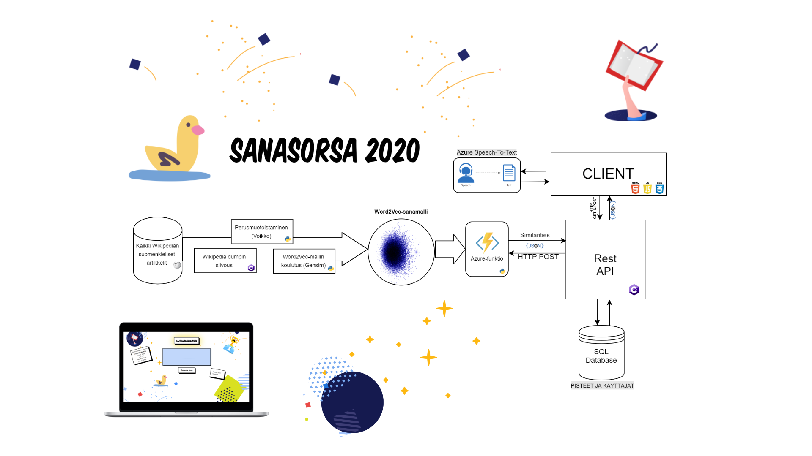
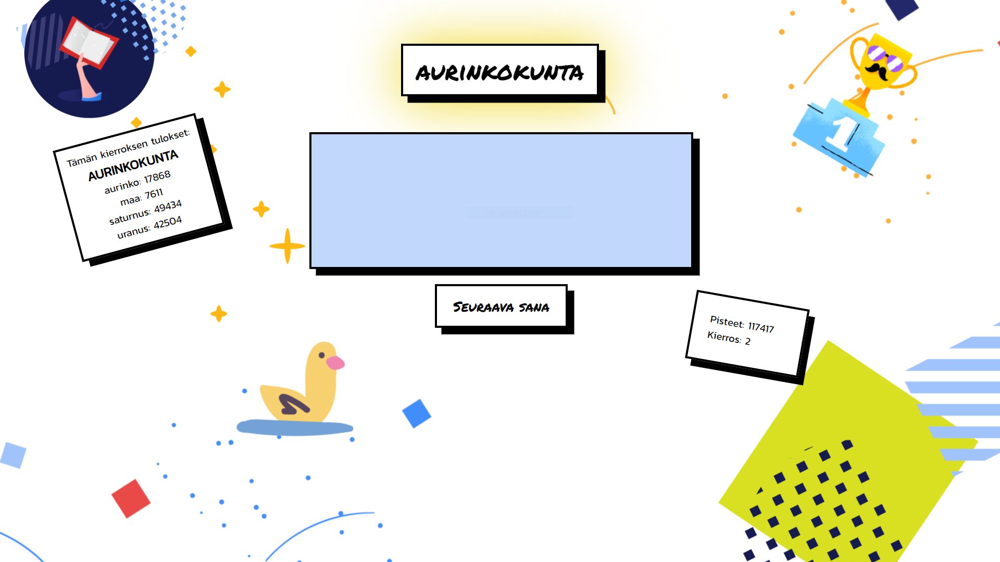

# Sanasorsa 2020

Sanasorsa 2020 is a small browser-based word game created as the final project for the C#.NET / Azure course of Academy Finland in 2019. The game utilises a machine learning model (Word2Vec) trained with Finnish Wikipedia articles to give scores to the player.

## Architecture

All the components of the game were designed to run on Azure. This Azure function was written in Python and it handles querying the Word2Vec model for distances between vectors and scoring the player's guesses according to the distances between the original prompt word and the guessed words. The function is called by the backend REST API written in C# instead of being called directly by the application frontend. The REST API handles checking for repeated guesses and normalising the user inputs.

## Gameplay Video

The game is voice controlled and can be played without using the keyboard. Alternatively, the player can write their guesses into the text box. The goal of the game is to list as many words related to the word provided by the game in 10 seconds. After three rounds, the player can choose to enter their score to be included in the leaderboard or they can start again without saving their scores.

[Watch the gameplay video here.](http://www.youtube.com/watch?v=vCN54GZkiyo "Sanasorsa 2020 Gameplay")

